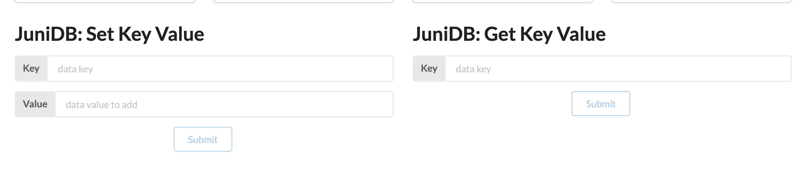
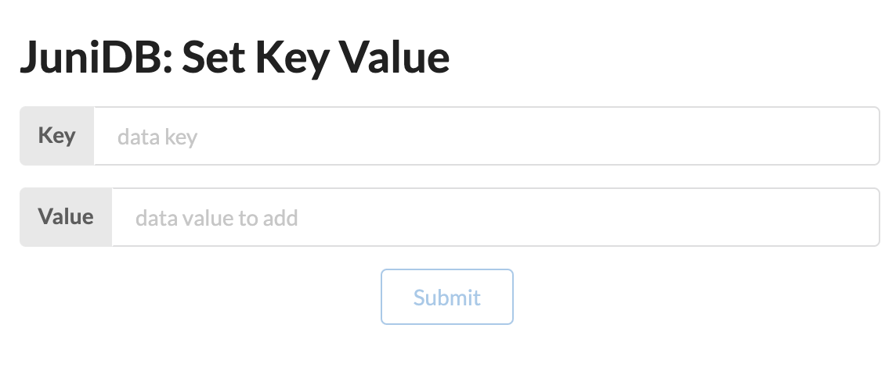
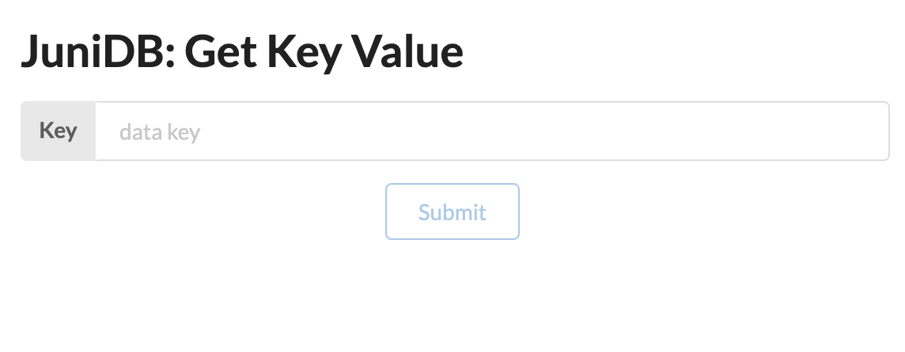

# Previewing the functionality in a UI

If you’re looking for a quick demo of the functionality, the simplest thing to do after running the
Docker container's default command is to launch the [juni-ui] UI.

## Instructions

1. If you have [node.js] and [yarn] installed on your machine, run the following commands:

    ```bash
    git clone https://github.com/uddugteam/juni-ui
    cd juni-ui
    yarn install
    yarn start
    ```

2. Once the UI opens in your browser you will see a JuniDB block at the top.
   <center></center>
3. For add new data to database you should write **key** and
   **value** in **Set Key Value** form fields and click to **submit button**.

   <center></center>

4. Then, to query data by field you should write key in **Get Key Value** form.

   <center></center>

[node.js]: https://nodejs.org
[yarn]: https://yarnpkg.com
[juni-ui]: https://github.com/uddugteam/juni-ui
